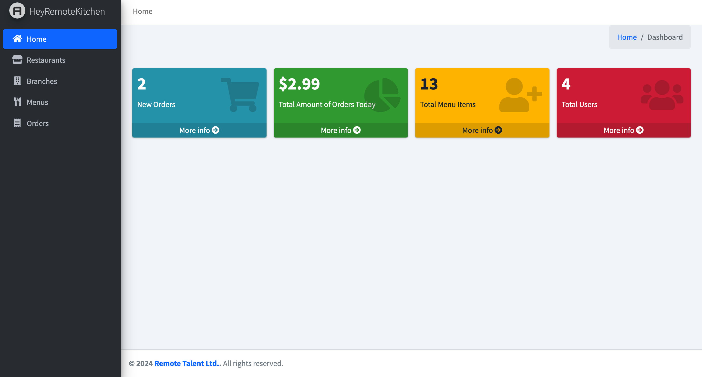
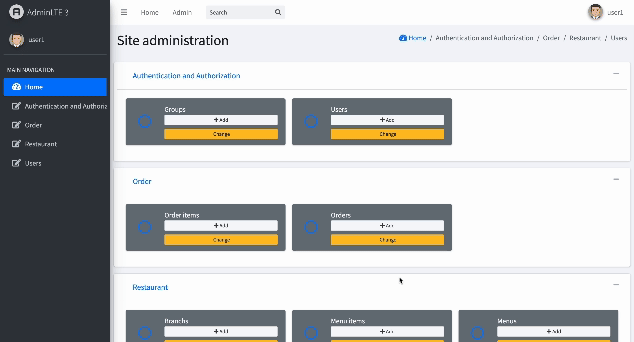

# HeyRemoteKitchen

**HeyRemoteKitchen** is a comprehensive Restaurant Management System built with Django. It provides features for managing restaurants, branches, employees, menus, and orders. This project leverages Django's powerful framework along with AdminLTE for a modern, responsive admin interface.

## Features

- **User Management**: Create and manage users with different roles, including superusers with full access.
- **Restaurant Management**: Add and manage multiple restaurants and their branches.
- **Employee Management**: Assign employees to restaurants and branches with various positions.
- **Menu Management**: Define menus and menu items for each branch.
- **Order Management**: Create and manage orders, including calculating totals and applying discounts.
- **Custom Admin Dashboard**: Utilize a custom admin dashboard with Django Jet and AdminLTE for a rich user experience.

## Dashboard



## Admin Panel



## Installation

### Prerequisites

- Python 3.8 or higher
- Django 4.2 or higher
- Virtualenv (optional but recommended)

## Usage

- **Adding Restaurants and Branches**: Use the admin interface to add and manage restaurants and branches.
- **Managing Employees**: Assign employees to different branches and set their positions and salaries.
- **Creating Menus and Menu Items**: Define menus and add items to them for each branch.
- **Placing Orders**: Create orders and manage them through the admin interface. Apply discounts and calculate total prices.

## Customization

- **Custom Dashboard**: Modify the `dashboard.py` file to customize the admin dashboard. You can configure widgets and layout as needed.
- **AdminLTE Integration**: Customize the look and feel of the admin interface using AdminLTE templates. Modify the templates and static files as required to match your design preferences.

## Commands

- **Populate Sample Data**: Use the custom management command to populate the database with sample data. This can be useful for testing and development.

  ```bash
  python manage.py populate_sample_data


## License

This project is licensed under the **MIT License**. See the LICENSE file for details.

## Acknowledgments

- **Django**: The powerful web framework used for this project.
- **AdminLTE**: For providing a modern and responsive admin dashboard interface.